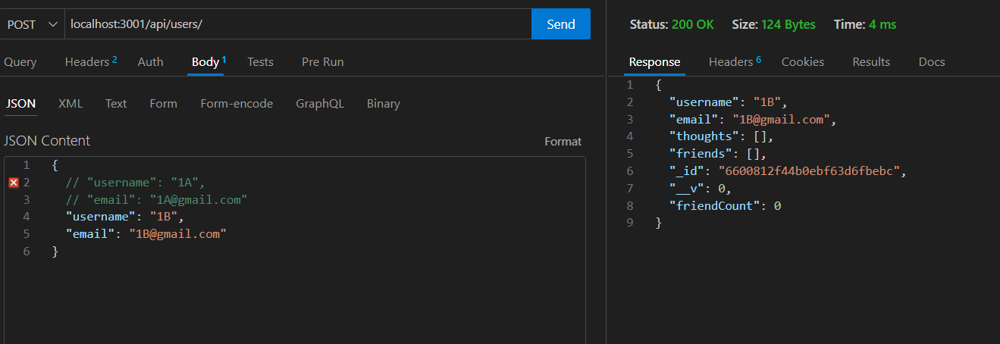

# Social-Networking

## Description
Social Networking is an API for a social network web application using Express.js for routing, MongoDB for the database, and Mongoose ODM. The API should allow users to share their thoughts, react to friends' thoughts, and manage a friend list.

## Link to Walkthrough Video
[Walkthrough Video](https://drive.google.com/file/d/100r02PHbab_ZdTfShZE8E38liFngs0w0/view)